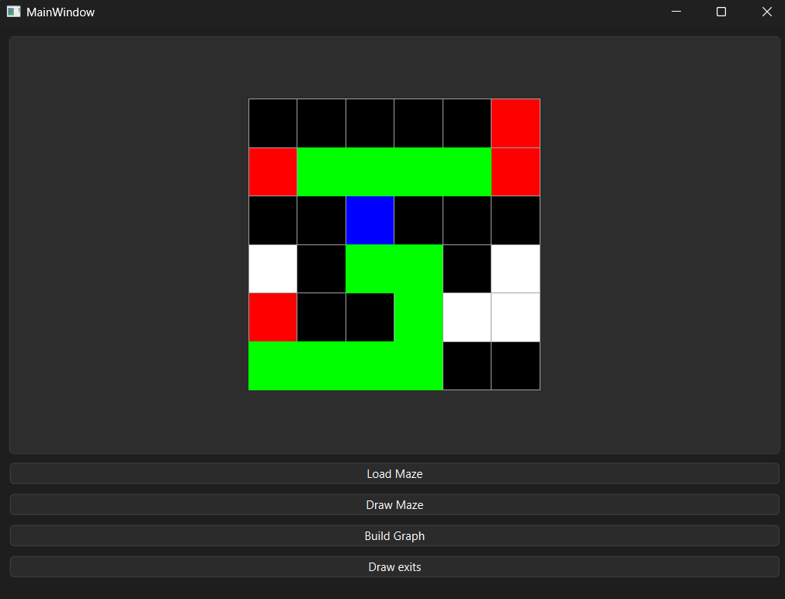

## Maze Solver
This project is a graphical application designed to solve mazes using the Breadth-First Search (BFS) algorithm. Built with C++ and the Qt framework, it allows users to visualize the solving process efficiently.

## Features
Visual Maze Representation: Clear distinction between paths, walls, the start, and the end points.
Pathfinding Algorithm: Implements BFS to find the shortest path from the entrance to the exit.
Interactive GUI: Built with Qt for a user-friendly interface.

## Maze Representation and Visualization
The maze is represented using a grid of numerical values, where each digit corresponds to a specific element of the maze and is rendered with a distinct color in the application:
* 1 (Path): Represents walkable areas. Color: White
* 0 (Wall): Represents impassable obstacles. Color: Black
* 3 (Entrance): Marks the starting point of the maze. Color: Green
* 2 (Exit): Marks the destination or exit points. Color: Red

## Technologies Used
Language: C++17
Framework: Qt (Core, GUI, Widgets)
Algorithm: BFS (Breadth-First Search)

## Contributing
Feel free to fork this project and submit pull requests if you have any improvements or features to add!

## Screenshot

